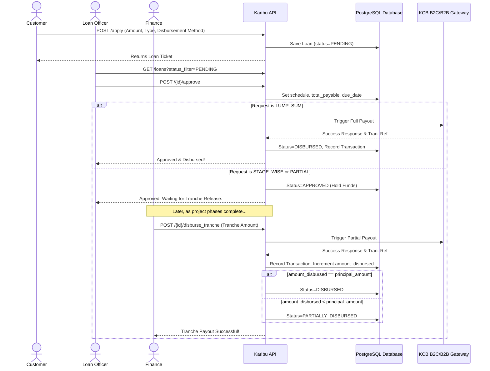
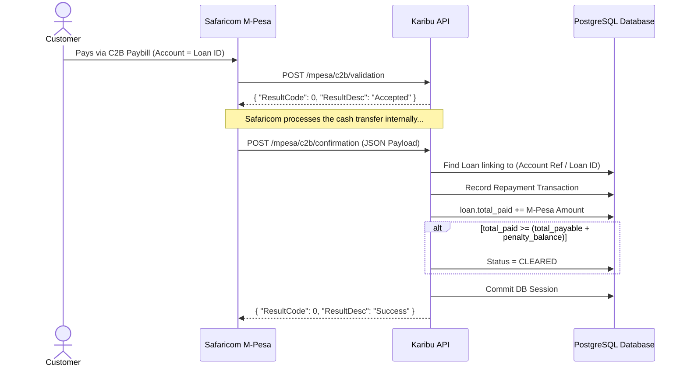

# Karibu Credit System Flow Diagrams

## 1. Loan Application & Disbursement Flow (Lump Sum vs Stage-wise)
This illustrates the origination logic, showing how the system branches depending on whether the loan requires a single lump-sum payout or stage-wise tranches.



## 2. M-Pesa Repayment & Auto-Clearing Flow
This shows how Safaricom's Daraja API interacts with our webhook endpoints when a customer makes a direct C2B Paybill payment.



## 3. Nightly Penalties & Defaults (Cron Job)
This maps the logic within `scripts/daily_penalties.py` which runs silently at midnight to catch overdue borrowers.

```mermaid
flowchart TD
    Start((Midnight<br/>Cron Trigger)) --> Fetch[Query DB: <br/>Active Loans past due_date]
    Fetch --> Check{Are there<br/>overdue loans?}
    
    Check -- Yes --> Loop[Loop through each Loan]
    Check -- No --> End((Sleep until tomorrow))
    
    Loop --> Calc[Calc: Outstanding Balance<br/>(payable - paid + penalties)]
    Calc --> IsOwed{Outstanding > 0?}
    
    IsOwed -- Yes --> ApplyPen[Apply 10% Penalty Fee]
    ApplyPen --> SetDef[Change Status to DEFAULTED]
    SetDef --> SaveRecord[(Save Transaction to DB)]
    SaveRecord --> Next[Next Loan]
    
    IsOwed -- No --> Next
    Next -.-> Loop
```
